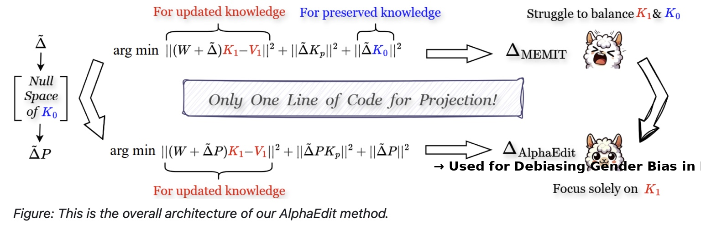

# Bias Be Gone: Model Editing for Gender Debiasing in Language Models

This repository contains the implementation of **AlphaEdit**, a model editing-based approach to reduce gender bias in large language models. Our method targets specific layers identified via causal tracing and applies null-space constrained weight edits to mitigate bias while preserving the model’s general knowledge.


*Figure: This is the overall architecture of our AlphaEdit method. Unlike MEMIT, which jointly balances updated and preserved knowledge (K₁ and K₀), AlphaEdit projects updates onto the null space of preserved knowledge (K₀), allowing focused and controlled edits.*


> **Note:** This repository is forked from [DAMA](https://github.com/tomlimi/DAMA) and extends the model editing framework to implement **AlphaEdit** a novel technique for targeted gender debiasing in language models using null-space constrained projection.


## Overview

Large language models (LLMs) often encode and amplify gender biases found in their training data. Traditional debiasing approaches like fine-tuning are costly and can degrade model performance. Our method offers a more efficient alternative using targeted model editing.

We extend the AlphaEdit method with:
- **Causal tracing** to locate biased components
- **Null-space projection** to ensure edits do not interfere with preserved knowledge
- **Support for GPT2-XL and LLaMA models (1B and 7B)**

## Key Features

- Bias localization using causal tracing  
- Precision editing with AlphaEdit  
- Supports multiple model architectures (GPT2-XL, LLaMA2-7B, LLaMA3.2-1B)  
- Evaluation on bias benchmarks (WinoBias, StereoSet)  
- Downstream task validation (ARC, OpenBookQA, WikiText-103)

## Causal Tracing

We use **causal tracing** (based MEMIT) to identify layers that encode biased associations. The process involves:

1. Injecting **biased prompts** alongside **counterfactual prompts**.
2. Monitoring how the model’s hidden activations evolve across layers.
3. Identifying layers that show strong influence from biased tokens but low correlation with factual cues.

This tracing helps us choose the **best layers to intervene** for debiasing, ensuring that our edits are both effective and targeted.

For GPT2-XL, layers `[13, 14, 15, 16, 17]` were selected based on tracing results.
For LLaMA models, layer choices were based on prior work and empirical validation.

## Results

| Model      | Method    | Bias ↓ | Factuality ↑ | WinoBias ↑ | StereoSet ICAT ↑ | PPL ↓ |
|------------|-----------|--------|---------------|------------|------------------|-------|
| GPT2-XL    | Base      | 0.243  | 0.330         | 34.5%      | 58.02            | 61.23 |
| GPT2-XL    | AlphaEdit | 0.051  | 0.366         | 39.5%      | 59.91            | 61.38 |
| LLaMA2-7B  | AlphaEdit | 0.151  | 0.322         | 36.4%      | 61.45            | 21.36 |

## Dataset

We use a curated dataset based on Bolukbasi et al. (2016) professions with gender stereotype scores. Prompts are generated using templates like:

- "The {profession} said that..."
- "The {profession} laughed because..."

Evaluated on:
- [WinoBias](https://github.com/uclanlp/corefBias)
- [StereoSet](https://github.com/moinnadeem/StereoSet)
- [ARC Challenge](https://allenai.org/data/arc)
- [OpenBookQA](https://allenai.org/data/open-book-qa)
- WikiText-103

## Installation

```bash
git clone https://github.com/srujana35/DAMA.git
cd DAMA
pip install -r requirements.txt
```
 
 ## Running AlphaEdit

To run AlphaEdit on GPT2-XL/Llama2-7B using causal tracing-informed layers:

```bash
python adapt_model.py 
    --model_name "gpt2-xl" 
    --method "ALPHA_EDIT" 
    --request_file "train_dama_processed.json" 
    --num_layers 5
    --post_linear True 
    --iterative_update True 
    --random_seed 45
```

## Evaluation

### Bias Evaluation

Run the following to evaluate on WinoBias and StereoSet:

```bash
python evaluate_model.py 
    --param_number 7 
    --method "ALPHA_EDIT" 
    --test_file "${ds}_${ds_split}.txt" 
    --test_task "coref" 
    --model_name gpt2-xl
```

This script evaluates:
	•	WinoBias: Coreference accuracy
	•	StereoSet: Stereotype Score (SS), Language Modeling Score (LMS), and ICAT

Downstream Evaluation

```bash
python evaluate_model.py 
    --param_number 7 
    --method "ALPHA_EDIT" 
    --test_task "qa" 
    --model_name gpt2-xl
```